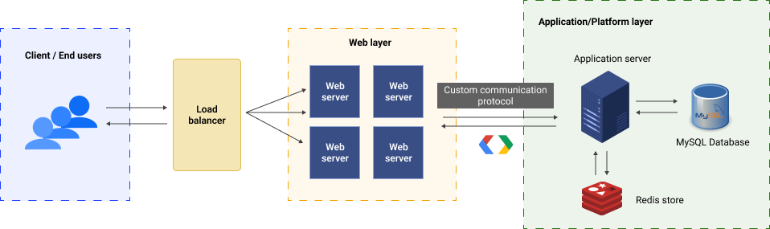

<h2>
    <b>Shillings</b>
</h2>

### **A. Overview**

This project aims to create a backend system that mocks payment services. It provides a suite of APIs that can be used for user authentication, payment, and other services.

<p align="center">
    
    <p align="center">Fig 1. <i>An overview of the backend system</i></p>
</p>

The web layer was separated from the application layer so that they could be scaled independently. The application layer handles all the business logic; on the other hand, the web layer handles all the user requests. Both layers communicate with each other using a custom communication protocol.

**Techstack**

-   _ Programming Language:_ `Golang`.
-   _Development:_ `MySQL`, `Redis`, `Protobuf`, `Nginx`, `Docker`.

### **B. System components**

| Component            | Description                                                                        |
| -------------------- | ---------------------------------------------------------------------------------- |
| `Web server`         | handles clients' http requests                                                     |
| `Application server` | handling all the business logic such as authentication, payment and user accounts. |
| `MySQL Database`     | Stores the user profile, credentials and transactions                              |
| `Redis`              | Stores the cached user profile                                                     |
| `Nginx`              | Used as a load balancer for the web server.                                        |

### **C. Installation**

**Prerequisites:** [Install Docker](https://docs.docker.com/get-docker/)

1. Build the required images

    ```bash
    make build
    ```

2. Start the services
    ```bash
    make prod
    ```

### **D. Usage**

**Available API Endpoints**

<details>
<summary>POST /v1/login</summary>

Request body:

```json
{
    "email": " <email>",
    "password": " <password>"
}
```

Response:

The `JWT token` is stored as a cookie in the response.

```json
{
    "status": {
        "code": " <code>",
        "message": " <message>"
    }
}
```

</details>

<details>
<summary>POST /v1/signup</summary>

Request body:

```json
{
    "first_name": " <first_name>",
    "middle_name": " <middle_name>",
    "last_name": " <last_name>",
    "email": " <email>",
    "phone": " <phone>",
    "password": " <password>"
}
```

Response:

```json
{
    "status": {
        "code": " <code>",
        "message": " <message>"
    }
}
```

</details>

<details>
<summary>GET /v1/account</summary>

Response:

```json
{
    "user": {
        "user_id": " <user_id>",
        "first_name": " <first_name>",
        "middle_name": " <middle_name>",
        "last_name": " <last_name>",
        "email": " <email>",
        "phone": " <phone>",
        "balance": " <balance>",
        "created_at": " <created_at>",
        "updated_at": " <updated_at>"
    },
    "status": {
        "code": " <code>",
        "message": " <message>"
    }
}
```

</details>

<details>
<summary>POST /v1/pay</summary>

Request body:

```json
{
    "receiver_email": "<receiver_email>",
    "amount": " <amount>"
}
```

Response:

```json
{
    "transaction_id": "<transaction_id>",
    "status": {
        "code": " <code>",
        "message": " <message>"
    }
}
```

</details>

<details>
<summary>POST /v1/topup</summary>

Request body:

```json
{
    "amount": " <amount>"
}
```

Response:

```json
{
    "status": {
        "code": " <code>",
        "message": " <message>"
    }
}
```

</details>

<details>
<summary>GET /v1/transactions</summary>

Response:

```json
{
    "transactions": [
        {
            "transaction_id": " <transaction_id>",
            "sender_email": " <sender_email>",
            "receiver_email": " <receiver_email>",
            "amount": " <amount>",
            "created_at": " <created_at>"
        }
    ],
    "status": {
        "code": " <code>",
        "message": " <message>"
    }
}
```

</details>

### **E. Technical details**

#### **1. Database**

**Tables**: `users`, `transactions`, `credentials`

| Table        | Columns                                                                                    |
| ------------ | ------------------------------------------------------------------------------------------ |
| users        | user_id, first_name, middle_name, last_name, email, phone, balance, created_at, updated_at |
| transactions | transaction_id, sender_id, sender_email, receiver_id, receiver_email, amount, created_at   |
| credentials  | credential_id, user_id, email, password, updated_at, last_login                            |

**Stack:** `MySQL`, `Redis`

-   `Redis` is used to cache the user data of authenticated tokens.

#### **2. Web Layer**

| API                | Method | Description                                |
| ------------------ | ------ | ------------------------------------------ |
| `/v1/login`        | `POST` | Authenticates the user and returns a token |
| `/v1/signup`       | `POST` | Register a new user                        |
| `/v1/account`      | `GET`  | Gets a user profile                        |
| `/v1/pay`          | `POST` | Makes a payment to another user            |
| `/v1/topup`        | `POST` | Tops up a user's account balance           |
| `/v1/transactions` | `GET`  | Get all the transactions made by a user    |

**Stack:** `Golang`, `Nginx`

#### **3. Application Layer**

#### **3a. Custom communication protocol**

The following table list of commands supported by the protocol.

| Command | Value | Function                                   |
| ------- | ----- | ------------------------------------------ |
| `LGN`   | 0     | Authenticates the user and returns a token |
| `SGN`   | 1     | Register a new user                        |
| `USR`   | 2     | Gets a user profile                        |
| `PAY`   | 3     | Makes a payment to another user            |
| `TPU`   | 4     | Top up a user's balance                    |
| `TXQ`   | 5     | Get all the transactions made by a user    |

The data is encoded in the following way:

-   The header is of size 4 bytes; This encodes the length of the payload.

    -   The payload is of size `<length>` bytes; This encodes the command and the data.

-   Allocate a buffer of size `<length>` bytes and read the data into it.

Furthermore, `protocol buffers` were used to serialize the data.

**Stack:** `Golang`, `Protobuf`

### **F. Interesting Situations**

-   `Application server cannot connect to the MySQL database`
    -   It was caused by the difference in startup time between the application server and the database server.
    -   By the time database starts, the application server is already running and has pinged the database server.
    -   **Solution:** To solve it I used `wait-for` package to listen to SQL server until it is ready and then start the application server.
-   `Redis set key issue`
    -   _Problem:_ Although the redis key is set, it was not found in later calls.
    -   I later realised that the `ttl` for the key was set to `1 second`; This was because, ttl is set based on the expiry time of the jwt token, however, the `time.Duration(ExpiryTime)` was not being converted corrently.
    -   _Solution:_ I converted the `ExpiryTime` from `int64` to time stamp and later used `time.Until(TimeStamp)` to set the `ttl` and
