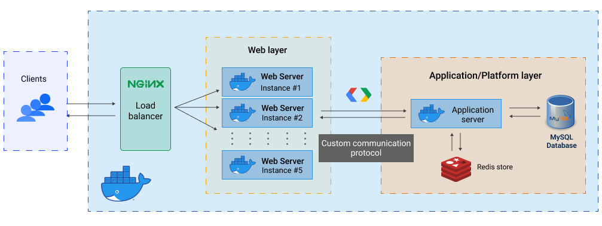

# Shillings

_A backend system for a payment service that allows you to send and receive money._

<p align="center">
    
    <p align="center">Fig 1. <i>An overview of the backend system</i></p>
</p>

### Project Scope

A set of web APIs that provide **payment services** with authentication. A _custom communication protocol (shillings)_ is used by the web and platform layer. The `platform layer` handles all the business logic and the `web layer` handles the client calls. _Shillings_ is a custom protocol on top of TCP written in `Go` to handle platform level services such as authentication, payment, database access, and so on.

## Technical Design Decisions

### 1. Database

**Tables**: `users`, `transactions`, `credentials`

| Table        | Columns                                                                               |
| ------------ | ------------------------------------------------------------------------------------- |
| users        | id, first_name, middle_name, last_name, email, phone, balance, created_at, updated_at |
| transactions | id, sender_id, receiver_id, amount, created_at                                        |
| credentials  | id, user_id, password, salt, updated_at, last_login                                   |

**Stack:** SQL

In addition, `redis` is used to cache the user data and authentication tokens.

#### **Tasks**

-   [ ] Setup SQL database locally (docker)
-   [ ] Setup redis locally (docker)
-   [ ] Populate the database with some data

### 2. Web Layer

| API                | Method | Description                                |
| ------------------ | ------ | ------------------------------------------ |
| `/v1/login`        | `POST` | Authenticates the user and returns a token |
| `/v1/signup`       | `POST` | Register a new user                        |
| `/v1/account`      | `GET`  | Gets a user profile                        |
| `/v1/pay`          | `POST` | Makes a payment to another user            |
| `/v1/topup`        | `PUT`  | Tops up a user's account balance           |
| `/v1/transactions` | `GET`  | Get all the transactions made by a user    |

#### **API Endpoints**

<details>
<summary>POST /v1/login</summary>

Request body:

```json
{
    "email": " <email>",
    "password": " <password>"
}
```

Response:

```json
{
    "auth": {
        "token": " <token>",
        "expiration_time": " <expiration_time>"
    },
    "status": {
        "code": " <code>",
        "message": " <message>"
    }
}
```

</details>

<details>
<summary>POST /v1/signup</summary>

Request body:

```json
{
    "user": {
        "first_name": " <first_name>",
        "middle_name": " <middle_name>",
        "last_name": " <last_name>",
        "email": " <email>",
        "phone": " <phone>"
    },
    "credentials": {
        "password": " <password>"
    }
}
```

Response:

```json
{
    "status": {
        "code": " <code>",
        "message": " <message>"
    }
}
```

</details>

<details>
<summary>GET /v1/account</summary>

Request body:

```json
{
    "user_id": " <user_id>",
    "auth": {
        "token": " <token>",
        "expiration_time": " <expiration_time>"
    }
}
```

Response:

```json
{
    "user": {
        "id": " <id>",
        "first_name": " <first_name>",
        "middle_name": " <middle_name>",
        "last_name": " <last_name>",
        "email": " <email>",
        "phone": " <phone>",
        "balance": " <balance>"
    },
    "status": {
        "code": " <code>",
        "message": " <message>"
    }
}
```

</details>

<details>
<summary>POST /v1/pay</summary>

Request body:

```json
{
    "receiver_email": " <receiver_id>",
    "amount": " <amount>",
    "auth": {
        "token": " <token>",
        "expiration_time": " <expiration_time>"
    }
}
```

Response:

```json
{
    "status": {
        "code": " <code>",
        "message": " <message>"
    }
}
```

</details>

<details>
<summary>PUT /v1/topup</summary>

Request body:

```json
{
    "user_id": " <user_id>",
    "amount": " <amount>",
    "auth": {
        "token": " <token>",
        "expiration_time": " <expiration_time>"
    }
}
```

Response:

```json
{
    "status": {
        "code": " <code>",
        "message": " <message>"
    }
}
```

</details>

<details>
<summary>GET /v1/transactions</summary>

Request body:

```json
{
    "user_id": " <user_id>",
    "auth": {
        "token": " <token>",
        "expiration_time": " <expiration_time>"
    }
}
```

Response:

```json
{
    "transactions": [
        {
            "id": " <id>",
            "sender_name": " <sender_name>",
            "receiver_name": " <receiver_name>",
            "amount": " <amount>",
            "created_at": " <created_at>"
        }
    ],
    "status": {
        "code": " <code>",
        "message": " <message>"
    }
}
```

</details>

#### **Tasks**

-   [ ] write the API handlers
-   [ ] Write the utility functions to handle protobuf, read and write requests with platform layer

### 3. Platform Layer

| Command | Value | Function                                   |
| ------- | ----- | ------------------------------------------ |
| `LGN`   | 0     | Authenticates the user and returns a token |
| `SGN`   | 1     | Register a new user                        |
| `ACCT`  | 2     | Gets a user profile                        |
| `PY`    | 3     | Makes a payment to another user            |
| `TPUP`  | 4     | Top up a user's balance                    |
| `TQRY`  | 5     | Get all the transactions made by a user    |

#### **Tasks**

-   [x] Write the required protobuf messages for the communication protocol
    -   [x] Compile the protobuf messages with `protoc`
-   [ ] Write the handlers for each command
-   [ ] Setup database handlers
    -   [ ] Write connection pool for the database
-   [ ] Setup redis handlers
    -   [ ] Write connection pool for the redis database
-   [ ] Add health check for platform server.

## Performance requirements:

-   [ ] Backend service should be able to handle a minimum of 10K qps
    -   Load test the backend service with `wrk`
